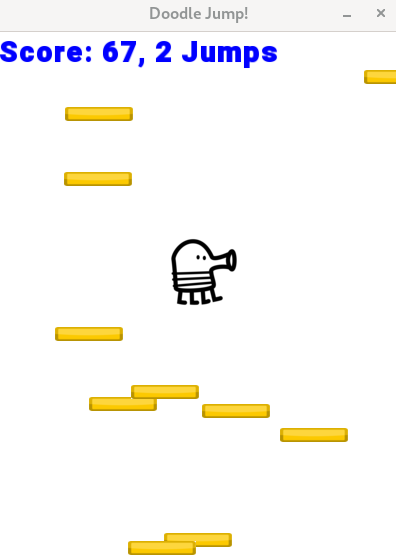

==This repo is for self-paced game projects==

### Release

* 2048(Desktop/Qt) To run the game, you might need to 1.build it from source code, or 2. install Qt on your machine run from the built release.

* Doodle Jump(Desktop/SFML) Build it from CMakeLists.txt.

* Flappy arrow(AI control)
  

  Thx for the visit!

More are coming~
